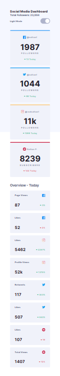

# Frontend Mentor - Social media dashboard with theme switcher solution

This is a solution to the [Social media dashboard with theme switcher challenge on Frontend Mentor](https://www.frontendmentor.io/challenges/social-media-dashboard-with-theme-switcher-6oY8ozp_H). Frontend Mentor challenges help you improve your coding skills by building realistic projects. 

## Overview

### The challenge

Users should be able to:

- View the optimal layout for the site depending on their device's screen size
- See hover states for all interactive elements on the page
- Toggle color theme to their preference

#### Desktop Screenshot Dark Theme ⬛

#### Desktop Screenshot Light Theme ⬜

#### Mobile Screenshot Dark Theme ⬛

#### Mobile Screenshot Light Theme ⬜

### link 🔗

- Live Site URL: https://lkiryu.github.io/social-media-dashboard-with-theme-switcher/

### Built with 🛠️

- HTML5
- CSS
- JS
---
### Author 👨‍💻
 Made by Matheus Antonio